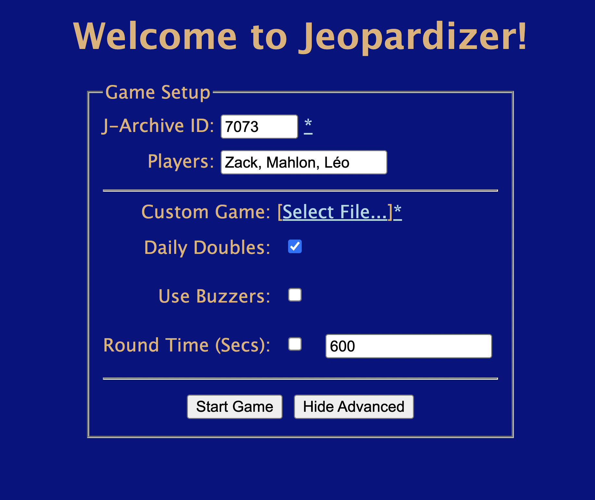

# Jeopardizer: Jeopardy, for the folks at home!



Jeopardizer is a webapp to host local games of Jeopardy! Designed for two monitors, one player takes the role of host, and the remaining players try their hands as contestants.

Games are loaded from [J-Archive](https://j-archive.com/) by providing the ID of a specific game (seen [here](https://j-archive.com/showgame.php?game_id=6969) as a URL parameter).

## Custom Games

By default, Jeopardizer pulls a provided J-Archive game. However, custom games can be defined as JSON files, and loaded in during game setup by the host. A [base template](./media/custom.json) is provided. Rounds can have any number of categories, categories can have any number of questions, and round board size will always be `# Categories * Max(# Questions)` for consistency. 

Question values can either be defined via a round multiplier (e.g. 2 for Double Jeopardy scoring), or on questions themselves. Daily doubles can either be assigned to specific questions, or a specific number can be designed per round which will be randomly assigned to (non-null) questions on the board. 

Questions can also be designed as "final" to have question screen display Final Jeopardy rather than Daily Double, and rounds themselves can have _mode_ "final" in order to stop progression after that round (future rounds can still be selected via dropdown, in the event of tiebreakers or additional rounds). Note that designating a round with mode final does not enforce wager logic (i.e. a normal round could be designated the final round).

Media support is currently being implemented, by way of the `media` property on a question. Question media has a type (audio, image, video), a path (URL), and various metadata properties (primarily: `start`, `stop` for audio/video, `width`, `height` for image/video). If a question has available media, the media can be (dis)played via console. For browser security reasons, media unfortunately **cannot be specified via a local path**. However, local files can be served on a URL by spinning up a local server in the desired directory; I recommend [http-server](https://www.npmjs.com/package/http-server), which supports range requests (unfortunately, Python `http.server` and `SimpleHTTPServer` do not, which prevents custom start points, at least in Google Chrome). 

## Known Limitations

J-Archive is wonderful, but only archives the _text_ content of questions, and cannot archive what was not seen in a real game. Games with missing questions will be rendered as gaps on the board in Jeopardizer, and questions which may have originally had media on the show (e.g. "The building seen here...") will not render said media (unfortunately, J-Archive does not have it).

## Credits 

- Full credit to J-Archive for all of their data, this app wouldn't be possible without them
- BroadcastChannel polyfill courtesy of [pubkey/broadcast-channel](https://github.com/pubkey/broadcast-channel)


## What's the deal with the /app/ folder?

Jeopardizer was originally a Java applet, revamped as a webapp for increased usability. Though hopefully functional, it hasn't been tested in several years, and is not actively maintained. Installation and controls are provided if desired:

<details>
<summary>Jeopardizer App Setup</summary>  

### Controls

- Questions can be accessed by clicking their respective squares
- Backspace will dock a player for a wrong answer, Enter will award points and escape the question. 
- A 5s timer can be intiated by pressing Control. If the players time out, or otherwise, tab can be used to exit the question without awarding/substracting points
- The host can hit the left and right arrow keys to switch between players for score awarding
- The tilde key will switch between rounds, or play sound effects if a question is active (incorrect/buzzer timeout noise, Final Jeopardy music)
- Shift will pull up the scores for players, but this can only be accessed from the question menu
- If a Daily Double question is opened, a wager must be input using non-numpad number keys (haven't actually tested with numpad though), hyphen/subtract key will remove the last number (-), and equals key (=) will input that wager, which can then be awarded/subtracted normally. Slash (/) will show the question if not visible after wager is input, or during Final Jeopardy.
- As a failsafe for an accidental misclick, a "wager" value can also be inputted outside of a question, and awarded to a player.

### Categories

By default, rounds in Jeopardizer are loaded from the single, double, and final jeopardy files located in data/questions/all, which are created by scraping J-Archive. Categories are randomly selected from these past files to create a standard Jeopardy game (6 categories for Single Jeopardy, 6 categories for Double Jeopardy, 1 category for Final Jeopardy), with the option for user-specified category count and date range are provided. Content-based filters are unlikely to be implemented as J-Archive is untagged.

Specific games are require a J-Archive URL, which is then scraped to create files in data/questions/custom, rather than the random category selection. This requires an internet connection.

### Custom Games

Custom games can be created by adding custom JSON files to data/questions/custom, based on the following structure:

```javascript
[
    {"Category":"CategoryName", 
    "Clues":[
        {
            "Question":"QuestionText", //Required
            "Answer":"AnswerText", //Required
            "Media":{ //Optional; parameters required
                "Name":"MediaName",
                "Type":"Audio | Video | Image", //Must be one of these
                "Path":"Filepath", 
            }
        }, 
        {
            "Question":"...",
            "Answer":"...",
            "Media":{
                ...
            }            
        }
        ...
    ], 
    "Date":"MM/DD/YYYY" //Optional, used for date filter
    }, 
    ...
]
```

Alternatively, simple categories can be created by adding plain text files to the process folder, with the following format:

```css
Category1|Q1|A1|Q2|A2|Q3|A3|Q4|A4|Q5|A5
Category2|Q1|A1|Q2|A2|Q3|A3|Q4|A4|Q5|A5
...
CategoryN|Q1|A1|Q2|A2|Q3|A3|Q4|A4|Q5|A5
```
Running either customs.py or Jeopardizer will move these files to data/questions/custom, where they can be loaded in as custom categories; this does not yet support media specifications, though those can be manually added to the generated JSON files. 

### Dependencies

<em>Game (Java)</em>

<ul>
    <li>
        Processing (Maven: org.processing:pdf:3.3.7)
        <ul>
            <li>All graphics-related code in this program is handled by Processing as the main graphics library.</li>
            <li>Java 1.7 or 1.8 must be used, as 1.9 is non-functional with Processing, and ThreadLocalRandom was only implemented in 1.8.</li>
        </ul>
    </li>
    <li>
        json-simple (Maven: com.googlecode.json-simple:json-simple:1.1.1)
        <ul>
            <li>json-simple is required used in order to parse the question json files and read them in as categories.</li>
        </ul>
    </li>
    <li>
        Minim (Maven: net.compartmental.code:minim:2.2.2)
        <ul>
            <li>Minim is used to play Jeopardy SFX—possibly overkill, but JavaSound felt like an ordeal</li>
        </ul>
    </li>
</ul>

<em>Scraper (Python)</em>

<ul> 
    <li>
        BeautifulSoup
        <ul><li>BeautifulSoup is used for to scrape J-Archive's game files, so install this in order to run the scraper</ul>
    </li>
</ul>
</details>
